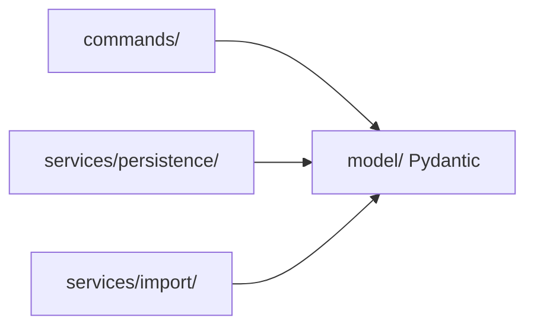
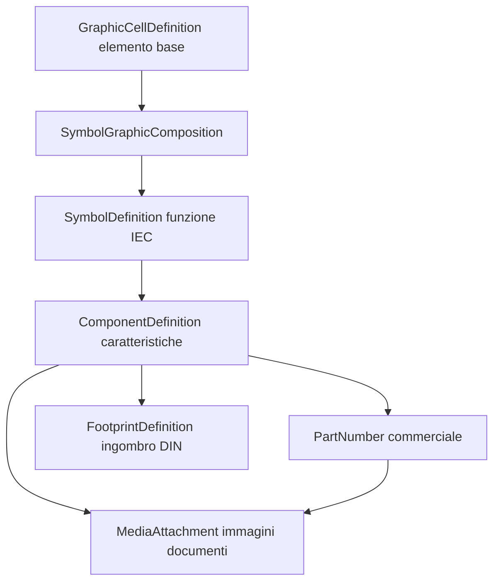
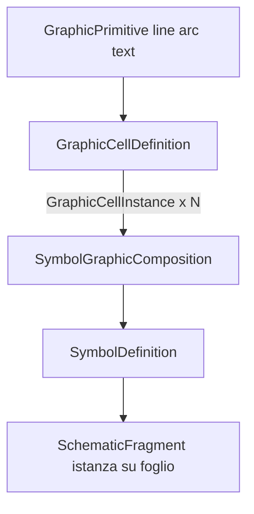
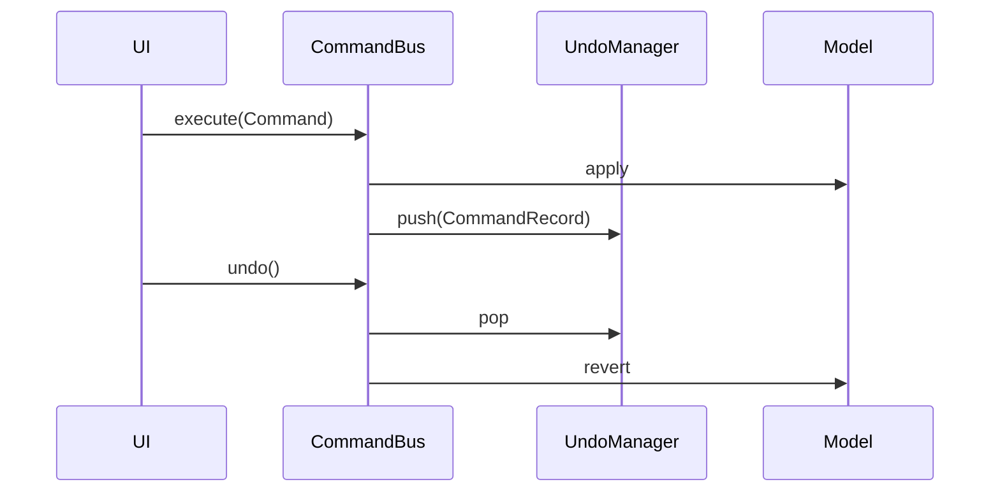
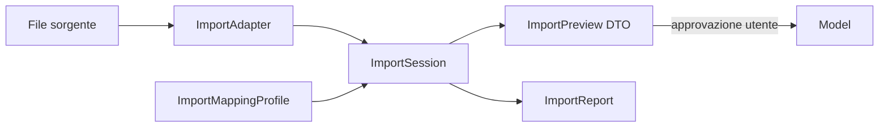

# Specifica data model — CAD elettrico TQVibeCAE

**Stato:** In discussione  
**Input:** [electrical-cad-design-considerations.md](electrical-cad-design-considerations.md)  
**Output atteso (promozione):** ADR-002, aggiornamento [domain-model.md](../program/domain-model.md), schemi in [schemas/](../program/schemas/)

---

## 1. Scopo e non-obiettivi

### Scopo

Definire la **struttura dati** di TQVibeCAE: entità dominio, topologia elettrica, catalogo libreria, **grafica schematica componibile**, **allegati multimediali**, persistenza, sessione (undo), impostazioni, localizzazione e contratti di import — in forma implementabile con **Pydantic v2**, MVVM rigido e design AI-first.

### Non-obiettivi (documenti o codice separati)

| Escluso da questa spec | Dove |
|------------------------|------|
| Algoritmi ERC completi | `services/validation/` |
| Rendering canvas Qt | `view/`, `services/rendering/` |
| Export PDF / etichette / cablaggio | `services/export/` |
| UI workflow | `view/`, `viewmodel/` |
| Parser EPLAN completi | `services/import/adapters/` |

---

## 2. Convenzioni

- **Pydantic v2** su tutte le entità persistite e DTO (vedi [ADR-001](../program/adr/001-pydantic-domain-models.md)).
- Ogni entità: `id: UUID`, `entity_type: str` (registry), `schema_version` sulle root.
- **Lingua codice:** inglese; **docstring:** italiano.
- **Unità SI:** A, V, W, mm², mm, °C.
- Errori strutturati: `ValidationIssue(code, severity, entity_path, message)`.
- Breaking change: migrazione esplicita + footer commit `BREAKING CHANGE:`.

### Entity base

```python
class Entity(BaseModel):
    model_config = ConfigDict(frozen=True)

    id: UUID
    entity_type: str
    human_label: str | None = None
    tags: frozenset[str] = Field(default_factory=frozenset)
    role: str | None = None  # es. "main_breaker" — utile per AI
```

---

## 3. Confini Model vs services

| Layer | Path | Responsabilità |
|-------|------|----------------|
| **Model** | `src/tqvibecae/model/` | Entità, invarianti, serializzazione JSON — **zero Qt** |
| **Commands** | `src/tqvibecae/commands/` | Mutazioni serializzabili, undo/redo |
| **Services** | `src/tqvibecae/services/` | I/O disco, SQLite libreria, import adapter, indici, migrator |
| **ViewModel** | `src/tqvibecae/viewmodel/` | Binding Qt, orchestrazione |
| **View** | `src/tqvibecae/view/` | Presentazione |

Il Model definisce **cosa** esiste; i services definiscono **come** si legge/scrive su disco.



---

## 4. Principio architetturale: Device come identità canonica

Un componente fisico (es. contattore KM1) esiste in tre mondi (§1 considerazioni):

| Mondo | Entità | Cardinalità vs Device |
|-------|--------|------------------------|
| Schema | `SchematicFragment` | N → 1 |
| Layout quadro | `LayoutPlacement` | 0..1 → 1 |
| BOM | `BomLine` | N → 1 |

**Master logico:** `Device`. Fragment, layout e BOM sono **proiezioni** con policy di sincronizzazione per categoria di property.

### Policy sync (default proposta)

| Categoria property | Comportamento |
|--------------------|---------------|
| Tecnica (tensione bobina, corrente, taglia) | Modifica su `Device` → propaga a tutte le viste |
| Referenza / designation | Modifica su `Device` → propaga |
| Geometria schema (posizione simbolo) | Solo su `SchematicFragment` |
| Geometria layout (posizione DIN) | Solo su `LayoutPlacement` |
| Righe BOM commerciali | Derivate da `SubComponent` + `PartNumber` |

Device presente solo nello schema (no layout) o solo nel layout (no schema): **ammesso** in fase di progettazione.

---

## 5. Catalogo libreria (SQLite, fuori progetto)

Separazione §7: simbolo ≠ componente ≠ articolo ≠ footprint.



| Entità | Descrizione |
|--------|-------------|
| `SymbolDefinition` | Funzione elettrica, pin template schematici, norma simbolo |
| `GraphicCellDefinition` | **Elemento grafico base riusabile** (contatto NA, arco, bobina…) |
| `SymbolGraphicComposition` | **Composizione** di celle grafiche (es. 3× contatto) + ancoraggi pin |
| `ComponentDefinition` | Categoria tecnica, slot subpart configurabili, regole compatibilità |
| `PartNumber` | Codice costruttore, datasheet, prezzo, ECLASS/ETIM |
| `FootprintDefinition` | Sagoma mm, moduli DIN, punti ancoraggio morsetti |
| `MediaAttachment` | Immagini, PDF, foto prodotto collegati a definizioni catalogo o device |

### Versioning

- Ogni definizione ha `definition_id` + `version: int` incrementale.
- Progetti referenziano `CatalogReference(definition_id, definition_version, catalog_kind)` — **immutabile** dopo assegnazione.
- Aggiornamento libreria non rompe progetti esistenti.

### Subpart e slot (§2)

`ComponentDefinition` espone:

- `auxiliary_slots: int` — slot blocchi ausiliari contattore
- `contact_block_slots: int` — slot pulsante XB4
- `compatible_subpart_ids: tuple[UUID, ...]` — regole compatibilità testa↔blocco

Persistenza: SQLite in path da `ApplicationSettings.library_db_path`, indici full-text su nome/codice/costruttore. File binari media in `library/media/` accanto al DB (path in `MediaAttachment.file_ref`).

---

## 5.1 Grafica schematica componibile (AI-friendly)

La **semantica elettrica** (`SymbolDefinition`, pin, funzione IEC) resta separata dalla **definizione grafica**. La grafica è **declarativa, JSON-serializzabile** e pensata per:

- riuso di elementi standard (una cella = un contatto, un arco, una bobina);
- composizione parametrica (es. interruttore 3P = **3×** cella `contact_no`);
- generazione e modifica da **AI** con validazione Pydantic + libreria celle esistente;
- rendering in View (`services/rendering/`) senza logic nel Model oltre ai DTO.



### Livelli grafici

| Livello | Entità | Esempio |
|---------|--------|---------|
| Primitiva | `GraphicPrimitive` | segmento, arco IEC, testo |
| Cella base | `GraphicCellDefinition` | contatto NA, contatto NC, simbolo motore |
| Composizione | `SymbolGraphicComposition` | 3× contatto + maniglia interruttore |
| Simbolo funzionale | `SymbolDefinition` | punta a composizione + mappa pin |
| Istanza foglio | `SchematicFragment` + `SymbolGraphic` (presentation) | posizione/rotazione su `Sheet` |

### GraphicPrimitive (atomo disegno)

```python
class GraphicPrimitive(BaseModel):
    model_config = ConfigDict(frozen=True)

    primitive_type: Literal["line", "polyline", "arc", "circle", "rect", "text"]
    geometry: dict[str, float | tuple[float, ...]]  # coordinate normalizzate
    stroke_width: float = 1.0
    layer: str = "symbol"
```

Coordinate in **unità normalizzate** (0..1 o mm simbolo) — indipendenti dallo zoom canvas.

### GraphicCellDefinition (elemento base riusabile)

```python
class PinAnchor(BaseModel):
    """Punto di connessione elettrica sulla cella (locale)."""
    anchor_id: str
    x: float
    y: float
    direction_deg: float | None = None

class GraphicCellDefinition(Entity):
    """Elemento grafico standard riusabile — es. un contatto NA IEC."""
    name: str
    category: str  # contact_no, contact_nc, coil, motor, ...
    primitives: tuple[GraphicPrimitive, ...]
    pin_anchors: tuple[PinAnchor, ...]
    width_mm: float
    height_mm: float
```

Catalogo libreria: versionato come le altre definizioni (`CatalogReference`).

### SymbolGraphicComposition (N × cella)

```python
class GraphicCellInstance(BaseModel):
    """Istanza di una cella base con transform."""
    cell_ref: CatalogReference
    instance_id: str
    transform: GraphicTransform  # translate, rotate, scale
    repeat_count: int = 1        # es. 3 contatti identici
    repeat_spacing_mm: float | None = None

class GraphicTransform(BaseModel):
    translate_x_mm: float = 0.0
    translate_y_mm: float = 0.0
    rotate_deg: float = 0.0
    scale: float = 1.0

class SymbolGraphicComposition(Entity):
    """Composizione di celle — es. interruttore 3 poli = 3× GraphicCellInstance(contact_no)."""
    name: str
    cells: tuple[GraphicCellInstance, ...]
    pin_map: tuple[PinMapping, ...]  # anchor cella → pin logico simbolo

class PinMapping(BaseModel):
    symbol_pin_id: str
    cell_instance_id: str
    cell_anchor_id: str
```

**Esempio concettuale:** contattore con 3 contatti di potenza = composizione con `repeat_count=3` su cella `contact_no` + 1 cella `coil` separata (fragment schematico distinto sul foglio, stesso `Device`).

### Collegamento SymbolDefinition

```python
class SymbolDefinition(Entity):
    function_class: str  # breaker, contactor, motor, ...
    graphic_composition_ref: CatalogReference
    connection_points_template: tuple[ConnectionPointTemplate, ...]
    # semantic IEC — indipendente dalla grafica
```

Cambio grafico (es. stile costruttore) **senza** cambiare pin semantici se `pin_map` resta coerente.

### AI — generazione grafica

| Step | Descrizione |
|------|-------------|
| 1 | AI riceve libreria `GraphicCellDefinition` disponibili (JSON Schema) |
| 2 | Propone `SymbolGraphicComposition` o modifica composizione esistente |
| 3 | Validazione: celle esistenti, `pin_map` completo, no primitive invalide |
| 4 | Preview rendering → utente approva → salva in libreria o applica a simbolo |

DTO dedicato: `SymbolGraphicProposal` (analogo a `ComponentGroupProposal`).

**Non** si inserisce SVG arbitrario non validato: preferire composizione da celle + primitive tipizzate (estensibili via registry).

### Presentation su foglio (View layer)

| Model dominio | Presentation (shard sheet) |
|---------------|----------------------------|
| `SchematicFragment` | `SymbolGraphic`: posizione, rotazione, `composition_ref` |
| `GraphicCellInstance` | già risolto da composition al render time |

Il Model catalogo contiene la **definizione**; il foglio contiene **istanza** + transform assoluta.

---

## 5.2 Allegati multimediali (immagini e documenti)

Ogni componente (e opzionalmente device di progetto) può avere **immagini** (foto, icona, SVG marketing) e **documenti** (PDF datasheet, scheda tecnica, certificazioni).

```python
class MediaKind(str, Enum):
    IMAGE = "image"
    DOCUMENT = "document"
    PHOTO = "photo"
    ICON = "icon"
    OTHER = "other"

class MediaAttachment(Entity):
    kind: MediaKind
    mime_type: str
    file_ref: str  # path relativo in library/media/ o .tqvibe/media/
    title: LocalizedString
    description: LocalizedString | None = None
    language: str | None = None  # BCP47, utile per PDF monolingua
    source_url: str | None = None  # link costruttore
    checksum_sha256: str | None = None
```

### Dove si attaccano

| Entità | Allegati tipici |
|--------|-----------------|
| `ComponentDefinition` | Icona categoria, diagramma generico |
| `PartNumber` | Datasheet PDF, foto prodotto, certificati |
| `FootprintDefinition` | Disegno dimensionale |
| `GraphicCellDefinition` | Anteprima PNG per picker libreria |
| `Device` (progetto) | Documenti commessa-specifici, foto campo |

```python
class MediaAttachmentRef(BaseModel):
    attachment_id: UUID
    role: str | None = None  # datasheet, photo, wiring_diagram, ...

class ComponentDefinition(Entity):
    # ... campi esistenti ...
    media: tuple[MediaAttachmentRef, ...] = ()
```

### Persistenza media

| Scope | Path | Note |
|-------|------|------|
| Libreria | `{library_root}/media/{attachment_id}/` | Condiviso tra progetti |
| Progetto | `.tqvibe/media/{attachment_id}/` | Solo quel progetto |

Metadati (`MediaAttachment`) in SQLite (libreria) o `project.json` / shard (progetto); blob su filesystem per git-friendly (file binari fuori JSON).

Import catalogo costruttore (ECLASS/Excel): popolare `PartNumber` + allegati PDF se URL/path fornito.

---

## 6. Progetto, fogli, revisioni

### Project root

```python
class Project(Entity):
    schema_version: int = Field(default=1, ge=1)
    name: str
    settings: ProjectSettings
    locale: ProjectLocaleProfile
    releases: tuple[ProjectRelease, ...] = ()
```

### Sheet e revisioni (§10)

| Concetto | Modello | Note |
|----------|---------|------|
| Foglio | `Sheet` | id, title, revision corrente, lock state |
| Revisione foglio | `SheetRevision` | A, B, C… — contenuto tecnico modificato |
| Emissione progetto | `ProjectRelease` | 00, 01, 02… — congela snapshot formale |
| Lock | `SheetLockState` | `draft` \| `approved` \| `released` — no modifica silenziosa su approved |

Revision cloud (geometria evidenziazione): **deferred** — campo riservato `revision_marks[]` su `Sheet`.

---

## 7. Device e decomposizione

```python
class CatalogReference(BaseModel):
    model_config = ConfigDict(frozen=True)
    definition_id: UUID
    definition_version: int
    catalog_kind: Literal["component", "symbol", "part", "footprint", "graphic_cell", "graphic_composition"]

class StructuredDesignation(BaseModel):
    """IEC 81346 — componente, locazione, funzione."""
    function_prefix: str | None = None   # =
    location_prefix: str | None = None   # +
    component_designator: str            # -KM1

class Device(Entity):
    designation: StructuredDesignation
    component_ref: CatalogReference | None = None
    part_ref: CatalogReference | None = None
    sub_components: tuple[SubComponent, ...] = ()
    schematic_fragment_ids: tuple[UUID, ...] = ()  # ref shard
    layout_placement_id: UUID | None = None
```

### Liste ortogonali (§2)

- **`SubComponent`**: parte fisica (blocco ausiliario, testa pulsante, insert connettore).
- **`SchematicFragment`**: apparizione grafica su `Sheet` (bobina, contatto, livello morsetto).
- Un subpart può generare **più** fragment su fogli diversi.

### PLC e I/O dinamici (§6) — fase v1

```python
class HardwareConfiguration(BaseModel):
    cpu_ref: CatalogReference
    rack_slots: tuple[RackSlot, ...]

class IoPin(Entity):
    logical_address: str   # I0.0, Q1.3
    physical_label: str
    connection_point_id: UUID
```

Pin generati **dopo** definizione configurazione hardware, non fissi nella definizione catalogo.

---

## 8. Connettività

### ConnectionPoint, Net, Potential (§3, §5, §9)

| Entità | Ruolo |
|--------|-------|
| `ConnectionPoint` | Nodo collegabile (pin, morsetto, bobina) |
| `Net` | Insieme topologico di CP connessi (grafo) |
| `PotentialAssignment` | Valore elettrico opzionale su net (24VDC+, PE…) |
| `GlobalNetDeclaration` | Net presenti su tutti i fogli (PE, N, …) |

**Net ≠ Potenziale:** ERC topologico usa `Net`; analisi PE/potenziale usa `PotentialAssignment` + regole propagazione documentate.

### Connettori (§3)

- `ConnectorPair`: XP1 ↔ XS1 con mapping pin speculare o custom.
- `PinRole`: `electrical` \| `unused` \| `mechanical` \| `shield`.
- Connettori composti (HAN): `CompositeConnector` con inserti figli.

### Morsettiere (§5)

- `TerminalBlock`: entità ordinata (X1), separatori, segna-gruppi.
- `Terminal`: tipi passante, fusibile, PE, schermo, doppio livello.
- `TerminalBridge`: collegamento adiacente morsetti — **attraversa ERC** senza filo visibile.

---

## 9. Cavi

### Modello unificato (§4)

**Decisione:** `Cable` con `cores[]`; filo unipolare = cavo con una sola anima.

```python
class LengthSpecification(BaseModel):
    value_mm: float
    source: Literal["estimated", "measured", "customer", "calculated"]
    tolerance_mm: float | None = None

class Core(Entity):
    color_code: str          # IEC 60757: BK, BU, GNYE…
    cross_section_mm2: float
    connection_point_ids: tuple[UUID, ...]

class Cable(Entity):
    designation: str         # W1, W2…
    cores: tuple[Core, ...]
    length: LengthSpecification | None = None
    shield: ShieldTermination | None = None
```

Cavi speciali (Profibus, SIL, fibra): `cable_kind` enum estensibile via registry.

---

## 10. Numerazione (§8)

`NumberingScheme` in `ProjectSettings`:

- Componenti: globale per tipo, per funzione, per foglio, IEC 81346 completo.
- Fili: per potenziale, sequenziale, per morsetto destinazione (DIN).

Regole **configurabili per progetto**, non hard-coded.

---

## 11. Template e macro (§13)

| Tipo | Modello | Comportamento |
|------|---------|---------------|
| Template | `TemplateDefinition` + istanza copiata | Modifica template **non** tocca istanze |
| Macro | `MacroDefinition` + `MacroInstance` | Modifica master **propaga** a istanze |
| Parametri | `MacroParameter` | Corrente motore → dimensiona protezioni |

---

## 12. Persistenza progetti e libreria (§11, §15)

### Layout cartella `.tqvibe/`

| Path | Contenuto |
|------|-----------|
| `manifest.json` | `ProjectManifest`: schema_version, id, shard refs, checksum |
| `project.json` | Metadati, `ProjectSettings`, releases |
| `index.json` | `ProjectIndex` denormalizzato |
| `sheets/{sheet_id}.json` | `Sheet` + ref grafiche |
| `devices/{device_id}.json` | `Device` shard (lazy load) |
| `topology/nets.json` | Net e collegamenti |
| `topology/cables.json` | Cavi e anime |
| `workspace/view_state.json` | `UserWorkspaceState` per progetto |

Archivio `.tqvibe.zip` opzionale per consegna singolo file.

### Requisiti I/O

- Scrittura **atomica**: temp file + rename.
- Shard corrotto → `ValidationIssue` per shard; altri shard apribili.
- `schema_version` + `services/persistence/migrator.py`.
- `ProjectIndex`: device→sheet, designation→device, net→devices — ricerca O(1) indicizzata.

### Libreria SQLite

Tabelle: `symbol_definitions`, `component_definitions`, `part_numbers`, `footprints` — chiave `(id, version)`.

### Autosave e recovery

| Artefatto | Path | Regola |
|-----------|------|--------|
| Save utente | `.tqvibe/` | Non sovrascritto da autosave |
| Recovery | `%TEMP%/TQVibeCAE/recovery/{project_id}/` | Timestamp; prompt al riavvio se più recente |
| Retention | `ApplicationSettings.recovery_retention_days` | Pulizia automatica |

Scrittura recovery **asincrona** — non blocca UI.

### Modelli contratto (`model/persistence.py`)

```python
class ShardRef(BaseModel):
    path: str
    entity_type: str
    checksum_sha256: str | None = None

class ProjectManifest(BaseModel):
    schema_version: int
    project_id: UUID
    shards: tuple[ShardRef, ...]
    saved_at: datetime

class RecoverySnapshotMeta(BaseModel):
    project_id: UUID
    recovery_path: str
    created_at: datetime
    base_manifest_checksum: str | None = None

class SavePolicy(BaseModel):
    atomic_write: bool = True
    update_index_on_save: bool = True
```

---

## 13. Undo / Redo e sessione (§11)

**Non persistito** su disco alla chiusura applicazione.



| Concetto | Descrizione |
|----------|-------------|
| `Command` | Mutazione serializzabile (regole AI-first) |
| `CommandBatch` | N comandi = 1 step undo |
| `UndoManager` | Stack undo + redo in memoria |
| `UndoPolicy` | Operazioni non undoable: rename file progetto, `ApplicationSettings` globali |

- `ApplicationSettings.undo_max_depth`: limite configurabile.
- **Save manuale non svuota** lo stack undo.
- Autosave/recovery **non** modifica lo stack.

Modelli sessione (non in project file):

```python
class CommandRecord(BaseModel):
    command_type: str
    payload: dict[str, object]
    executed_at: datetime
    batch_id: UUID | None = None
```

---

## 14. Impostazioni a tre livelli (§12)

### Precedence

```
ProjectSettings  >  ApplicationSettings  >  built-in defaults
UserWorkspaceState — solo UI/layout, NON sovrascrive norme elettriche
```

| Modello | Persistenza |
|---------|-------------|
| `ApplicationSettings` | `%APPDATA%/TQVibeCAE/settings.json` |
| `ProjectSettings` | `project.json` |
| `UserWorkspaceState` | `.tqvibe/workspace/` (+ opz. globale recenti) |

### ApplicationSettings (esempi)

- `library_db_path`, `default_projects_path`
- `ui_language: str` (BCP47)
- `theme`, `keyboard_shortcuts`
- `autosave_interval_sec`, `recovery_retention_days`
- `undo_max_depth`

### ProjectSettings (esempi)

- `reference_standard: Literal["IEC", "NFPA", "GB", ...]`
- `numbering_scheme: NumberingScheme`
- `global_nets: tuple[GlobalNetDeclaration, ...]`
- `default_sheet_format`
- `title_block_template_id`

Progetto NFPA **resta NFPA** anche se installazione locale è IEC.

---

## 15. Lingue e localizzazione (§14)

```python
class LocalizedString(BaseModel):
    default: str
    translations: dict[str, str] = Field(default_factory=dict)  # BCP47

class ProjectLocaleProfile(BaseModel):
    document_languages: tuple[str, ...]
    number_format: Literal["eu", "us"]
    ui_language_override: str | None = None
```

| Uso | Tipo |
|-----|------|
| Descrizione device, note foglio, cartiglio | `LocalizedString` |
| UI applicazione | Qt `.ts` — **non** nel Model |
| Export documenti | lingua da `ProjectLocaleProfile.document_languages` |

Struttura `LocalizedString` obbligatoria **day-1** (traduzioni possono essere stub).

---

## 16. Import e interoperabilità (§17)

Pipeline in `services/import/` — adapter pattern.



### Formati

| Formato | Adapter | Scope | Fase |
|---------|---------|-------|------|
| EPLAN P8 XML / export | `EplanImportAdapter` | Pagine, simboli, net, referenze | v1 |
| DXF/DWG | `DxfImportAdapter` | Solo geometria | v2 |
| ECLASS / ETIM / Excel | `CatalogImportAdapter` | Libreria catalogo | v2 |
| AutoCAD Electrical | `AceImportAdapter` | Progetto | deferred |
| SEE Electrical | `SeeImportAdapter` | Progetto | deferred |

Dettaglio mapping EPLAN: [import-eplan-mapping-notes.md](import-eplan-mapping-notes.md).

### Modelli (`model/import.py`)

```python
class ExternalFormat(str, Enum):
    EPLAN_XML = "eplan_xml"
    DXF = "dxf"
    ECLASS = "eclass"
    ETIM = "etim"
    MANUFACTURER_EXCEL = "manufacturer_excel"

class ImportSession(BaseModel):
    id: UUID
    source_format: ExternalFormat
    source_path: str
    target_project_id: UUID | None
    mapping_profile_id: UUID
    status: Literal["pending", "running", "preview", "completed", "failed"]

class UnmappedExternalRef(BaseModel):
    external_id: str
    external_kind: str
    reason: str

class ImportReport(BaseModel):
    imported_devices: int
    imported_nets: int
    skipped_symbols: int
    warnings: tuple[ValidationIssue, ...]
    unmapped_entities: tuple[UnmappedExternalRef, ...]
```

### Workflow import (allineato §16 AI)

1. Utente seleziona file → `ImportSession`
2. Adapter produce **preview** (non ancora nel progetto)
3. Utente rivede mapping e conflitti
4. Utente approva → `CommandBatch` inserisce nel Model
5. Validazione Pydantic + ERC preliminare → `ImportReport`

**Non** si importa silenziosamente senza review.

### Limiti MVP import EPLAN

| Importato | Non importato (MVP) |
|-----------|---------------------|
| Pagine, simboli base, connessioni | Layout quadro completo |
| Referenze componenti | Macro EPLAN con parametri |
| Part number se in export | Link TIA Portal |
| Cross-ref multipagina base | Export verso EPLAN |

---

## 17. Integrazione AI (§16)

| Elemento | Descrizione |
|----------|-------------|
| `ComponentGroupProposal` | DTO AI — circuito proposto, non ancora nel progetto |
| `SymbolGraphicProposal` | DTO AI — composizione grafica da celle base, preview prima del salvataggio |
| `ProjectContextSnapshot` | Query read-only: devices, nets, settings, numbering, **celle grafiche disponibili** |
| Pipeline | `model_validate` → lib refs exist → ERC gruppo → user approve → `Command` |
| Grafica | AI compone `SymbolGraphicComposition` riusando `GraphicCellDefinition` esistenti |

Stesso path UI e agent: **CommandBus**.

---

## 18. Mapping tracciabilità (considerazioni → modello)

| § | Tema | Entità / decisione | Fase |
|---|------|-------------------|------|
| 1 | Tre mondi | `Device` master, fragment/layout/BOM proiezioni | MVP |
| 2 | Subpart / fragment | Liste ortogonali su `Device` | MVP |
| 3 | Connettori | `ConnectorPair`, `PinRole`, inserti composti | v1 |
| 4 | Cavi | `Cable`+`Core`, `LengthSpecification` | MVP |
| 5 | Morsettiere | `TerminalBlock`, `Terminal`, `TerminalBridge` | v1 |
| 6 | PLC | `HardwareConfiguration`, `IoPin` dinamici | v1 |
| 7 | Simbolo/articolo/footprint | Catalogo + `CatalogReference`; grafica componibile §5.1 | MVP |
| 8 | Numerazione | `NumberingScheme`, `StructuredDesignation` | MVP |
| 9 | Net/potenziale | `Net`, `PotentialAssignment`, `GlobalNetDeclaration` | MVP |
| 10 | Revisioni | `SheetRevision`, `ProjectRelease`, lock | v1 |
| 11 | Persistenza | `.tqvibe/` shard, SQLite, recovery | MVP |
| 11 | Undo | `Command`/`CommandBatch`, stack memoria | MVP |
| 12 | Settings | 3 livelli + precedence | MVP |
| 13 | Template/macro | `TemplateDefinition`, `MacroInstance` | v1 |
| 14 | i18n | `LocalizedString`, `ProjectLocaleProfile` | MVP struct |
| 15 | Performance | `ProjectIndex`, lazy shard load | MVP |
| 16 | AI | Proposal DTO, validazione, approve; **`SymbolGraphicProposal`** | v1 |
| — | Grafica componibile | `GraphicCellDefinition`, `SymbolGraphicComposition`, riuso N× | MVP struct |
| — | Media | `MediaAttachment` su catalogo/device | MVP struct |
| 17 | Import | `ImportSession`, adapter EPLAN/DXF/catalogo | v1/v2 |

---

## 19. Roadmap implementazione

### MVP (struttura day-1)

- `Entity`, `Device`, `SchematicFragment`, `Net`, `Cable`, `Core`
- Catalogo refs + DTO libreria
- **`GraphicCellDefinition`, `SymbolGraphicComposition`, `GraphicPrimitive`** (struct catalogo)
- **`MediaAttachment`, `MediaAttachmentRef`**
- `.tqvibe/` layout + manifest + index + `media/`
- `ProjectSettings`, `ApplicationSettings`, `LocalizedString` struct
- `Command` + undo stack base
- `ProjectIndex` schema

### v1

- Morsettiere, connettori, PLC config, layout placement, BOM
- Revisioni/lock fogli
- Template/macro
- Import EPLAN preview + `ImportReport`
- Autosave/recovery completo
- AI `ComponentGroupProposal`, **`SymbolGraphicProposal`**

### v2 / deferred

- Import DXF, cataloghi ECLASS/ETIM, ACE, SEE
- Revision cloud geometry
- ERC dinamico stati contatto
- Export bidirezionale EPLAN
- ERP, stampanti etichette

---

## Appendice A — Moduli Pydantic previsti

| Modulo | Modelli |
|--------|---------|
| `model/base.py` | `Entity`, `LocalizedString`, `ProjectLocaleProfile`, `ValidationIssue` |
| `model/project.py` | `Project`, `ProjectManifest`, `ProjectSettings`, `Sheet`, `ProjectIndex` |
| `model/persistence.py` | `ShardRef`, `RecoverySnapshotMeta`, `SavePolicy` |
| `model/settings.py` | `ApplicationSettings`, `UserWorkspaceState`, `NumberingScheme` |
| `model/device.py` | `Device`, `SubComponent`, `SchematicFragment`, `StructuredDesignation` |
| `model/catalog_refs.py` | `CatalogReference` |
| `model/topology.py` | `ConnectionPoint`, `Net`, `Cable`, `Core`, `PotentialAssignment` |
| `model/connectivity.py` | `TerminalBlock`, `Terminal`, `TerminalBridge`, `ConnectorPair` |
| `model/library/` | `SymbolDefinition`, `ComponentDefinition`, `PartNumber`, `FootprintDefinition` |
| `model/graphics/` | `GraphicPrimitive`, `GraphicCellDefinition`, `GraphicCellInstance`, `SymbolGraphicComposition`, `PinMapping`, `PinAnchor` |
| `model/media.py` | `MediaAttachment`, `MediaAttachmentRef`, `MediaKind` |
| `model/import.py` | `ImportSession`, `ImportReport`, `ExternalFormat` |
| `model/revisions.py` | `SheetRevision`, `ProjectRelease`, `SheetLockState` |
| `model/macro.py` | `TemplateDefinition`, `MacroDefinition`, `MacroInstance` |

---

## Appendice B — Open questions

Vedi [data-model-open-questions.md](data-model-open-questions.md) per decisioni in sospeso da review.

---

## Riferimenti

- [electrical-cad-design-considerations.md](electrical-cad-design-considerations.md)
- [import-eplan-mapping-notes.md](import-eplan-mapping-notes.md)
- [data-model-open-questions.md](data-model-open-questions.md)
- [domain-model.mdc](../../.cursor/rules/domain-model.mdc)
- [ai-first-design.mdc](../../.cursor/rules/ai-first-design.mdc)
